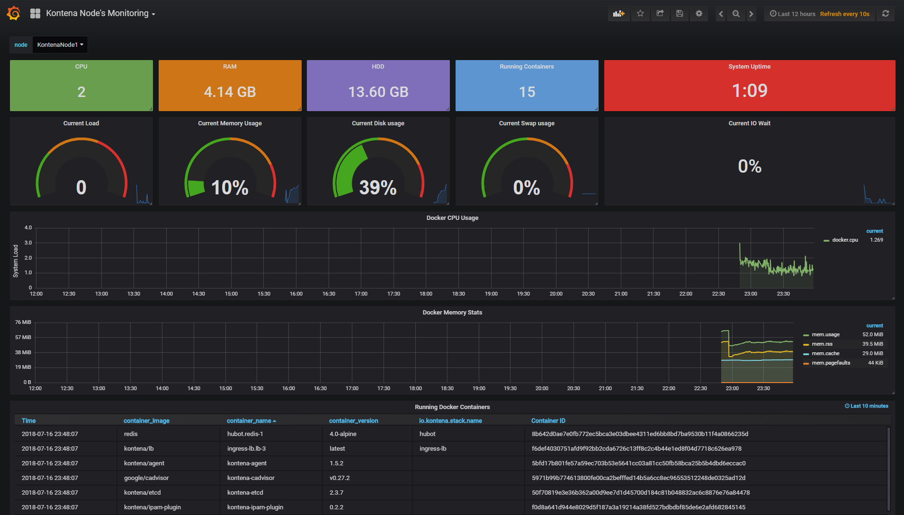

# TIG stack (Telegraf + InfluxDB + Grafana) for Kontena environment
Kontena Stack for gathering and displaying metrics from nodes.

## Usage with Kontena
InfluxDB and Grafana needs instance scoped volumes to persist their data. Create the volumes:
```
kontena volume create --scope instance --driver local influxdb-data
kontena volume create --scope instance --driver local grafana-data
```
Install the stack:
```
kontena stack install
```

## During the installation
It is possible to reset all passwords which will be stored to Kontena Vault every time when installing or upgrading the stack.

##### InfluxDB
- Database `telegraf` will be created.
- Users `admin`, `grafana` (read permissions) and `telegraf` (read and write permissions) will be created and their passwords will be stored to Kontena Vault.

##### Grafana
- a custom Grafana image is being used which includes configuration files for dashboard provisioning and the actual dashboard for displaying metrics from nodes.
- User `admin` for the UI will be created and it's password will be stored to Kontena Vault.
- Datasource (InfluxDB) will be created using `grafana` user.
- Users are not allowed to sign up.
- Plugins: `clock-panel` and `simple-json-datasource` will be installed.

##### Telegraf
- a custom Telegraf image is being used which includes configuration file that reads certain values from environment variables e.g. InfluxDB username, password and url.
- Telegraf agent authenticates to InfluxDB using `telegraf` user.

## How does it look

